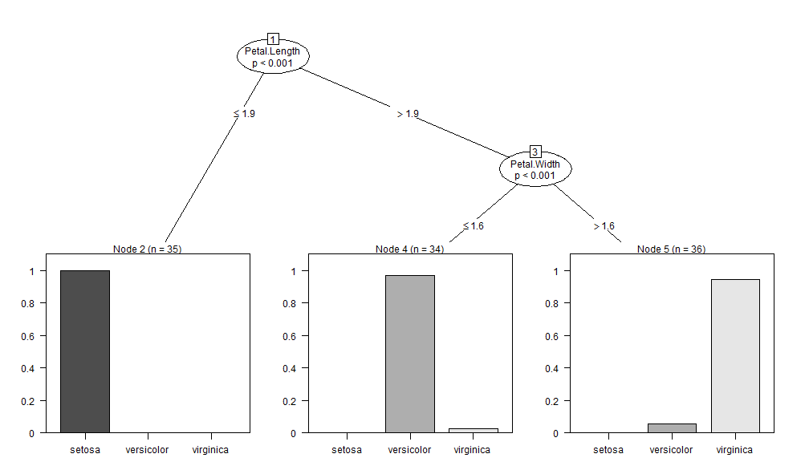
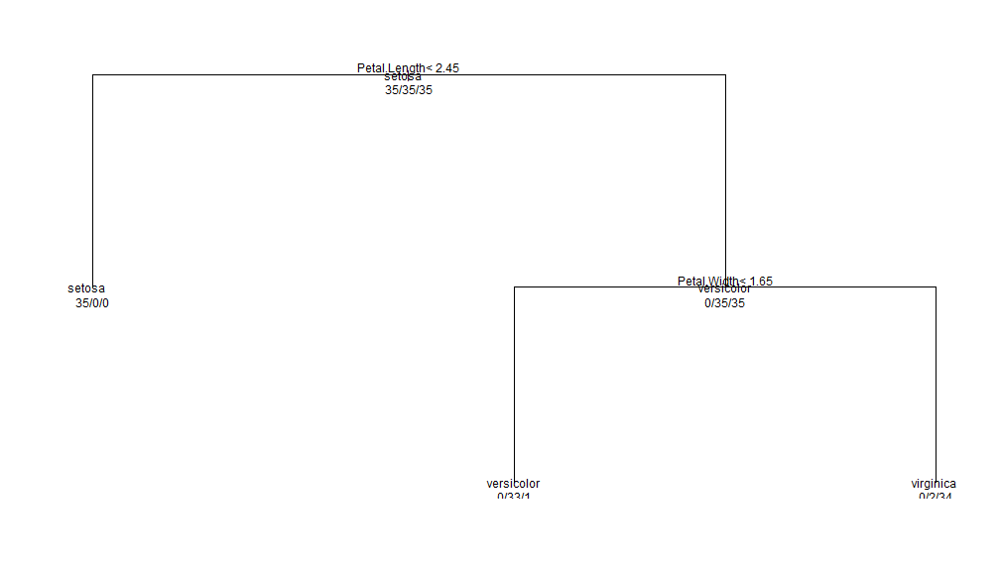

Coursera Assigment: Tree-classifiers
========================================================
author: Cesar Garcia
date: 20150322

Tree Classifiers - Basic comparison
========================================================

We will use a simple shiny application to allow the user
to compare several tree classifiers in the well known dataset iris
in a very easy way.

The selectable models are:

- ctree
- ctree2
- rpart
- rpart2

Ctree classifiers
========================================================

 

If one of the ctree family classifiers is selected, the user can see the plot is clear and give a lot of information about the model

Rpart classifiers
========================================================

 

In the other hand if one of the rpart family classifiers is selected, the user can see a plot quite poorer than ctree's one. The cut values for Petal Lenght variable are different too

Classifiers accuracy
========================================================
___Ctree___

```
             
testPredCtree setosa versicolor virginica
   setosa         15          0         0
   versicolor      0         15         3
   virginica       0          0        12
```
___Rpart___

```
             
testPredRpart setosa versicolor virginica
   setosa         15          0         0
   versicolor      0         15         3
   virginica       0          0        12
```

Accuracy (ctree and rpart) is equal for the same test dataset
